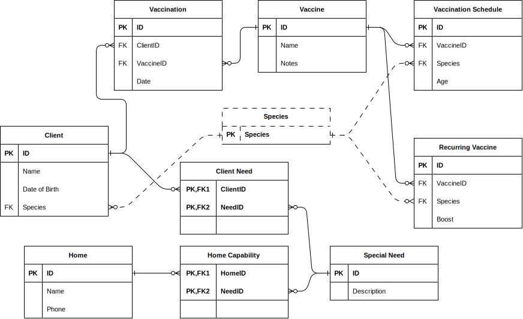

# Animal Shelter Sample Database

This is a sample database that models an animal shelter,
with a number of link tables and many-to-many relationships
that offer opportunities to work with JOINs.

## What is included

- "shelter.html" which describes the scenario in more detail and provides suggests on writing JOINs
- a Diagrams.net ERD for the database (SVG in HTML)
- SQL to create and populate the database
- a "setup.sh" file that scripts dropping, recreating, and populating the sample
- a "query.sh" file that scripts running the sample
- "TRACKING.md": a framework for tracking work
- suggested queries that could be implemented
- DevContainer files to run in a GitHub Codespaces or DevContainer environment

## Some potential queries

- Client Needs
- Series Schedule
- Vaccination History
- Booster Timing
- Available Homes
- Booster Vaccination Schedule

These suggestions have more detailed specifications in the SQL files
beginning with "query-". If you implement a different query, please
include a specification explaining why the query is useful.

## What to do

- read the HTML
- start the Codespace
- set up the database with the setup.sh script (from Terminal, run "bash setup.sh")
- review the specifications in the query files
- work on queries that interest you
- optional: update TRACKING.md with your experience (short is OK!)

## Design

